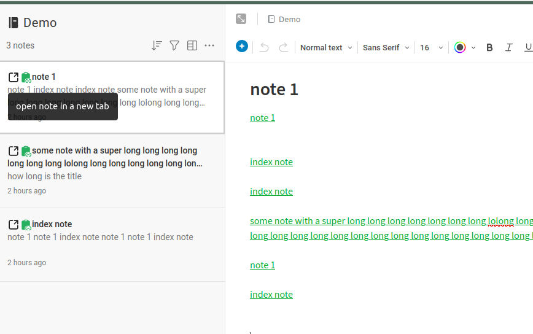
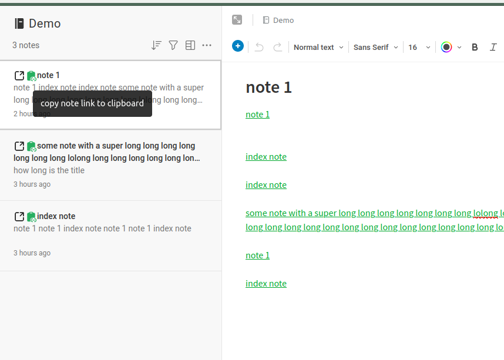

Evernote Helper Firefox addon
----------------------------------------------

# Install
- Install directly from [Mozilla](https://addons.mozilla.org/en-CA/firefox/addon/evernote-helper/).
- Install from source.
    - Clone this repo. Run `package.sh` to package the addon.
    - [Install it using firefox debugging](https://extensionworkshop.com/documentation/develop/temporary-installation-in-firefox/).
    - [Install it as unsigned extension](https://extensionworkshop.com/documentation/publish/signing-and-distribution-overview/).

# What it does

- Add a link to open a note in a new tab.
- Add a link to copy the note link so you can [reference it in other notes](https://help.evernote.com/hc/en-us/articles/208313588) or in other applications.

